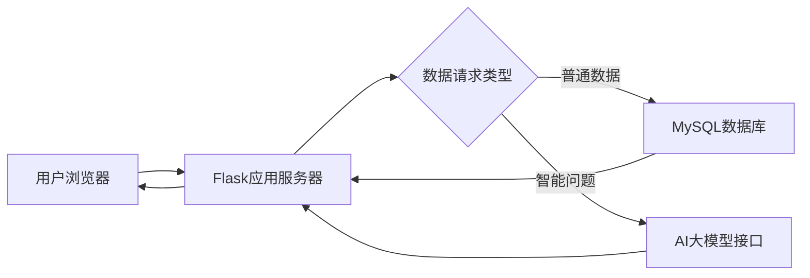
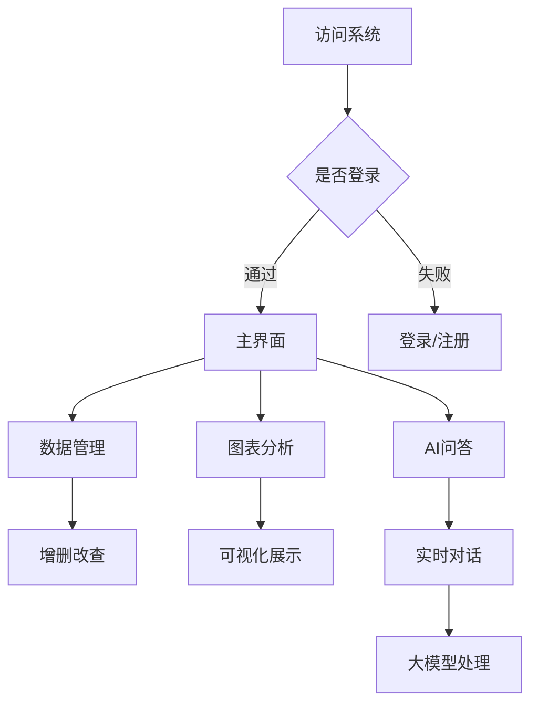

# 工会管理系统

## 一、项目概述

本系统是一个基于Python Flask框架的工会信息管理平台，实现用户账户管理、数据可视化分析、AI智能问答等功能。系统基于现代Web技术构建，采用MVC架构模式，通过MySQL数据库持久化存储数据，结合前端Bootstrap框架实现响应式界面，集成硅基流动大模型实现自然语言查询。

## 二、功能模块

### 1. 用户管理模块

- 登录认证：用户需要账号密码登录，系统会验证身份
- 注册功能：新用户可注册账号，系统自动检查信息是否合规
- 权限控制：通过tokens字段区分管理员(GUEST/ADMIN)权限
  + **普通用户(GUEST)**：查看基本信息和图表
  + **管理员(ADMIN)**：可管理所有数据，包括增删改查
- 数据表：用户信息安全存储在数据库的`users`表（username,password,tokens）

### 2. 数据管理模块

+ 管理功能

  管理工会会员的**账户和贷款信息**，包括：

| 信息类别 | 具体内容                         |
| -------- | -------------------------------- |
| 基本信息 | 姓名、电话、身份证号             |
| 账户信息 | 账户类型、开户日期、账户余额     |
| 贷款信息 | 贷款类型、金额、日期、期限、渠道 |
| 还款状态 | 是否按时还款、还款进度等         |

	增删改查：支持分页展示（10条/页）
	数据模型：`user_accounts`表（用户账户信息）
	字段包含：
	"user_name, phone_number, id_card_number, account_type, opening_date, account_balance, loan_type, loan_amount, loan_date, loan_term, loan_channel, repayment_status"

+ 操作功能
  - 添加新会员信息
  - 修改现有信息(后台处理)
  - 删除无效记录(后台处理)
  - 分页浏览（每页显示10条，类似翻书）

### 3. 图表分析模块

将复杂的财务数据转化为**直观图表**，帮助快速理解。

**双模式展示**（使用Plotly.js实现动态可视化）：

- 折线图：展示数据随时间的变化趋势（如每月贷款金额变化）
- 箱型图：比较不同数据分布（如各类贷款分布）

**分析维度**：

- 贷款类型分布：哪种贷款最受欢迎
- 金融指标对比：贷款金额 vs 账户余额的关系

### 4. AI问答模块

采用先进人工智能，集成硅基流动Qwen3-32B大模型，支持自然语言查询。

**技术特点**：

- 实时对话：问题即时回答，类似微信聊天
- 备用通道：当实时连接不稳定时自动切换普通模式

**能回答的问题类型**：

- 会员信息查询："张三的贷款情况如何？"
- 数据统计分析："上个月哪种贷款类型最多？"
- 业务规则咨询："申请教育贷款需要什么条件？"

## 三、技术栈

| 层级     | 技术选型      | 介绍                                     |
| -------- | ------------- | ---------------------------------------- |
| 前端     | Bootstrap 4   | 网页界面设计工具，确保美观且兼容各种设备 |
|          | jQuery        | 让网页更动态、交互更流畅                 |
|          | Plotly.js     | 专业图表绘制工具                         |
| 后端     | Python 3.10   | 系统后台使用的编程语言                   |
|          | Flask 2.3     | 构建Web应用的框架（类似建筑的钢结构）    |
| 数据库   | MySQL 8.0     | 数据存储仓库（类似电子表格但更强大）     |
|          | PyMySQL       | Python连接MySQL的工具                    |
| AI模型   | Qwen3-32B API | 人工智能引擎（系统的大脑）               |
| 安全     | WTForms验证   | 表单安全检查（防止错误或恶意输入）       |
|          | Session鉴权   | 登录状态管理（确保只有合法用户能访问）   |
| 构建工具 | pipenv        | 项目管理工具（类似工具箱）               |
|          | Jinja2        | 网页模板引擎（内容动态填充工具）         |

## 四、系统架构



**架构说明**：

1. 用户通过浏览器访问系统
2. 请求发送到Flask服务器（系统核心）
3. 普通数据请求（如会员信息）直接访问数据库
4. 智能问题请求转交AI大模型处理
5. 结果返回给服务器，再展示给用户

## 五、核心代码

### 1. 数据库连接（app.py）

```python
def get_db_connection():
    return pymysql.connect(
        host='localhost',
        user='root',
        password='114514',
        db='db_test',
        charset='utf8mb4',
        auth_plugin_map={'mysql_native_password':
                             None},
        cursorclass=pymysql.cursors.DictCursor)
```

使用DictCursor返回字典类型结果，支持中文字符集，采用mysql_native_password认证插件。

### 2. AI问答集成（app.py）

```python
def chat_with_large_model(message):
    headers = {
        "Authorization": f"Bearer {API_KEY}",
        "Content-Type": "application/json"
    }
    data = {
        "model": MODEL_NAME,
        "messages": [{"role": "user", "content": message}],
        "tools": [{"type": "function",
                   "function": {
                       "name": "get_user_info",
                       "description": "获取用户贷款信息",
                       "parameters": {
                           "type": "object",
                           "properties": {
                               "user_name": {
                                   "type": "string"}}}}}]}


response = requests.post(f"{BASE_URL}/chat/completions", json=data, headers=headers)
return response.json()['choices'][0]['message']['content']
```

调用大模型时，通过发送包含用户消息和工具定义的JSON数据到指定的API端点，并使用授权令牌进行身份验证。

### 3. 动态分页实现（index.html）

```javascript
// 根据总页数动态生成分页控件 
for (let page = startPage; page <= endPage; page++) {
    const li = document.createElement('li');
    li.className = page - item ${page === currentPage ? 'active' : ''};
    const a = document.createElement('a');
    a.className = 'page-link';
    a.href = /list/${pageSize}
    /${page}; 
    a.textContent = page;
    li.appendChild(a);
    document.querySelector('.pagination').appendChild(li);
}
```

根据总页数动态生成分页控件，并高亮当前页。

## 六、操作流程图



## 七、扩展方向

此工会系统目前为课程实践版本，较为基础，后续扩展方向如下：

1. 增强安全：添加安全防护、SQL注入过滤
2. 多维分析：增加热力图、雷达图等高级分析
3. 权限升级：实现RBAC权限模型，不同管理员有不同管理范围
4. 性能优化：高频数据缓存，响应更快
5. 智能预测：使用机器学习进行贷款风险评估，基于历史数据预测贷款风险
